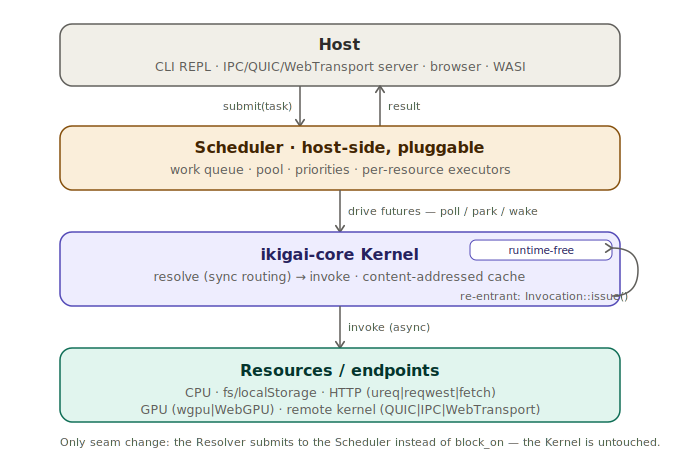
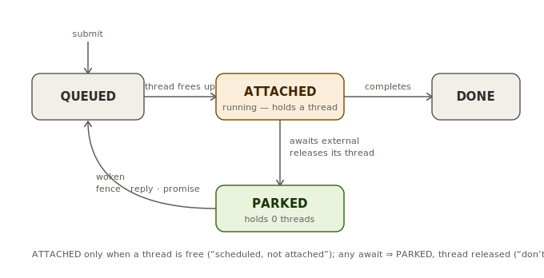
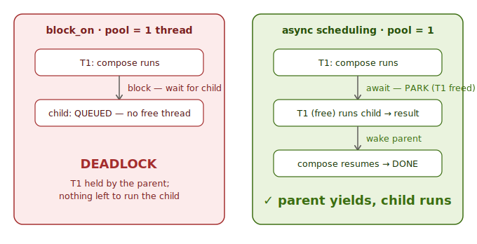
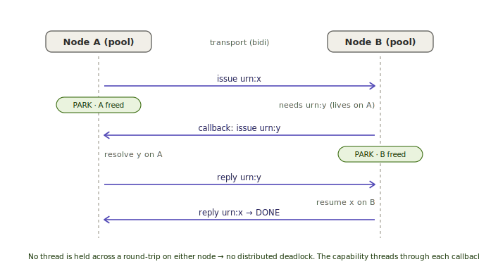

# ikigai scheduler design

Status: **design / proposal** (no code yet). Captures the async-scheduling model,
its backends, and how GPU and transport-callbacks fit. Diagrams are ASCII so they
read in a terminal and on GitHub alike.

---

## 1. Why

NetKernel ran **everything async-scheduled** on a core threadpool (default = cores,
configurable), with a work queue: work was *scheduled* but not *attached* to a
thread until one was free, and I/O-blocking work was never held on a CPU while it
waited. Synchronous handling was an *adaptation* on the async base.

ikigai today is the **inverse**: `Kernel::issue` and `Endpoint::invoke` are `async`,
but the kernel owns **no runtime, pool, or queue** — it just produces futures. The
hosts drive them:

- **CLI / browser** — driven by a synchronous `block_on` (in `ikigai-resolve`). One
  thread, blocked until the future resolves.
- **Servers (IPC/QUIC/WebTransport)** — driven by Tokio tasks.

So we have *async types, synchronous driving*. That's fine while every endpoint is
immediately-ready (the `fn`/`fs`-localStorage demos), but it breaks the moment real
work appears:

- **HTTP** pins the driving thread for the whole round-trip (`ureq` blocks; the
  `async` signatures don't yield). `compose` over several `urn:httpGet` markers runs
  them *sequentially* despite the existing `try_join_all`.
- **Re-entrant `compose` on a bounded pool deadlocks** under `block_on`: a parent
  blocks a thread waiting for a child; fill the pool with parents and no thread is
  left to run a child.
- **Browser `fetch`** can't run at all — `block_on` on the single wasm thread can't
  yield to the JS event loop, so a pending network call deadlocks (see
  `project-ikigai-web-demo` "#2 blocked on async-eval").

The fix is to restore NetKernel's order: an **async scheduler** as the base, with
sync as an adaptation.

---

## 2. Principles

1. **The kernel stays runtime-free.** `ikigai-core` must compile to and run in the
   browser (single-threaded, no threads) and on WASI. So the scheduler is a
   **host-side seam above the kernel**, never baked into core.
2. **Everything is a scheduled task** — an inbound request (REPL line, a call
   arriving on a transport), local resolution, a re-entrant sub-request, a callback.
   One queue.
3. **Park, don't block.** Awaiting *anything* external — a CPU sub-task, a GPU
   fence, a network reply, a JS promise — **parks the task and frees the thread.** A
   parked task holds no CPU.
4. **Tasks have an affinity and a wait-mode** (§5). Most are free to run on any pool
   thread; some are pinned to a resource (a GPU queue, a JS agent, a connection).
5. **Separation of concerns:** *resolution* decides **what / where** (which endpoint,
   local vs remote — a space/transport decision); the *scheduler* decides **when / on
   which thread**; the *transport* is just another parkable resource. Keep these
   apart and "fancier over time" never means "rewrite."

---

## 3. Layered architecture

```
┌──────────────────────────────────────────────────────────────────────┐
│ Host: CLI REPL · IPC/QUIC/WebTransport server · browser page · WASI    │
│   submits work, awaits results (sync REPL feel = await one task)       │
└───────────────┬───────────────────────────────────────▲────────────────┘
                │ submit(task, affinity, priority)        │ result
                ▼                                          │
┌──────────────────────────────────────────────────────────────────────┐
│ Scheduler  — host-side, pluggable, configurable                        │
│   work queue · pool · priorities · per-resource executors              │
│   backends: single | pool:N | wasm-loop | wasm-workers | gpu | …       │
└───────────────┬───────────────────────────────────────▲────────────────┘
                │ drives futures (poll / park / wake)     │ wake on completion
                ▼                                          │
┌──────────────────────────────────────────────────────────────────────┐
│ ikigai-core Kernel  — runtime-free: async fns + content-addressed cache│
│   issue() → resolve (sync routing) → invoke endpoint                   │
│            └── re-entrant: Invocation::issue() back into the kernel ────┘
└───────────────┬────────────────────────────────────────────────────────┘
                │ Endpoint::invoke (async)
                ▼
┌──────────────────────────────────────────────────────────────────────┐
│ Resources / endpoints                                                  │
│  CPU compute · fs/localStorage · HTTP (ureq|reqwest|fetch) ·           │
│  GPU (wgpu|WebGPU) · remote kernel (QUIC|IPC|WebTransport)             │
└──────────────────────────────────────────────────────────────────────┘
```



The only change to the existing seam: `ikigai-resolve`'s `Resolver` stops calling
`block_on(kernel.issue(...))` inline and instead **submits the future to the
scheduler and awaits the handle**. The kernel is untouched.

---

## 4. The scheduler seam (sketch)

A host-side trait; the kernel never sees it. Shape (illustrative, not final):

```
/// Where a task may run.
enum Affinity {
    Any,                 // CPU-free: any pool thread
    Resource(ResourceId) // pinned: a GPU queue, a JS agent, a connection
}

enum Priority { Low, Normal, High }   // room to grow (deadlines, fairness)

trait Scheduler: Send + Sync {
    /// Submit a future as a task; returns a handle to await its result.
    /// `affinity` pins resource-bound work; `Any` runs on the pool.
    fn submit<F: Future + Send>(&self, task: F, affinity: Affinity, prio: Priority)
        -> TaskHandle<F::Output>;

    /// Run blocking work off the CPU pool (dedicated blocking sub-pool / spawn_blocking).
    fn submit_blocking<R: Send>(&self, f: impl FnOnce() -> R + Send) -> TaskHandle<R>;
}
```

Notes:
- `submit` for `Affinity::Any` requires `F: Send` — the CPU pool can migrate it.
  Resource-pinned and loop-bound tasks (JS/`fetch`, GPU) use a non-`Send` path that
  runs *on* the resource's thread, so they never need to cross threads (§5, §9).
- The kernel's cache is already `Arc<Mutex<…>>` (`Send + Sync`), so a real
  threadpool — and later a shared-memory wasm worker pool — needs no kernel change.

---

## 5. Task taxonomy

The one idea that makes GPU, JS-`fetch`, blocking I/O, and the transport all fit the
same model:

```
class             affinity            wait-mode (how it parks)          examples
────────────────  ──────────────────  ───────────────────────────────  ─────────────────────────
CPU task          Any (pool)          on a sub-task / nothing          to_upper, compose glue, RDF
resource-pinned   Resource(queue)     on a device fence / agent loop   GPU dispatch, WebGPU
agent/loop-bound  Resource(agent)     on a JS promise (spawn_local)    browser fetch (JsValue !Send)
blocking I/O      blocking sub-pool   thread parks in the sub-pool     ureq, std::fs on native
transport-parked  Resource(conn)      on a wire reply                  remote source/sink, callbacks
```

Crucial fact that forces the pinned classes: **`JsValue` is per-agent and `!Send`
*regardless of threads*** — a `fetch` promise belongs to the agent that made it, and
even shared-memory wasm threads can't move it. A **GPU device handle is the same** —
bound to the queue/thread that owns it. So "resource-pinned, cooperatively
scheduled" is a first-class class, not a special case; JS and GPU share the
mechanism.

---

## 6. Task lifecycle — "scheduled, not attached; park, don't block"

```
        submit
          │
          ▼
       ┌────────┐   a thread frees up    ┌───────────────┐
       │ QUEUED │ ─────────────────────▶ │   ATTACHED    │
       └────────┘                        │   (running)   │
          ▲                              └──────┬────────┘
          │ woken                                │ awaits an external completion
          │ (fence | wire reply |                │ (GPU fence | net reply |
          │  promise | sub-task done)            │  blocking result | JS promise)
       ┌────────┐                                ▼
       │ PARKED │ ◀──────────────────────────────┘
       └────────┘   ◀── thread RELEASED back to the pool ──
          │
          ▼ on completion
        DONE  → result handed to the awaiter
```



`QUEUED → ATTACHED` only when a thread is free = NetKernel's "scheduled but not
attached." `ATTACHED → PARKED` on any await, **releasing the thread** = "don't hold
I/O-blocking work on a CPU." A parked task costs zero threads.

---

## 7. Backend options

```
Scheduler backend
├─ single          current-thread, no pool        CLI default · today's block_on path
├─ pool:N          native OS threadpool (N=cores)  CLI `--async` / `config scheduler=pool:N`,
│                  + blocking sub-pool             servers                  ◀── MILESTONE 1
├─ wasm-loop       JS event loop (spawn_local),    browser default; unblocks fetch + async eval
│                  cooperative single-thread                                ◀── MILESTONE 2
├─ wasm-workers    shared-memory worker pool        browser real threads; needs COOP/COEP +
│                  (SharedArrayBuffer + atomics)     nightly+build-std; coi-serviceworker on Pages
├─ gpu             device queue + fence (wgpu),      a per-resource executor *alongside* the CPU
│                  WebGPU promise on wasm            pool, not a replacement
└─ (remote)        NOT a backend — a remote resource is a *resolution* over a transport;
                   the remote node runs its own scheduler (§9, §10)
```

Backend × platform × memory-sharing × readiness:

```
backend        platform   shared mem   parallel   status / caveats
─────────────  ─────────  ───────────  ─────────  ─────────────────────────────────────
single         all        n/a          no         exists (block_on); stays the safe default
pool:N         native     yes (Arc)    yes        buildable now (std threads / a runtime)
wasm-loop      browser    n/a          no         needs async eval entry (evalLineAsync→Promise)
wasm-workers   browser    yes (SAB)    yes        nightly + -Z build-std + atomics; COOP/COEP;
                                                   Pages needs a coi-serviceworker shim — VERIFY
                                                   current toolchain stability before relying on it
wasi-threads   WASI rt    yes          yes        experimental (Wasmtime); component-model
                                                   "shared-everything threads" in progress
msg-passing    browser    NO           yes*       separate wasm instances + postMessage; *parallel
 workers                                           but no shared cache → actor/coordinator shape,
                                                   not a drop-in pool (documented alternative)
```

Design allows for *imminent* wasm threads without committing: `wasm-workers` is a
drop-in `Scheduler` backend; the kernel is already `Send + Sync`; loop-bound JS work
is never migrated, so it coexists with a worker pool.

---

## 8. Re-entrancy & deadlock

**Local `compose` on one thread:**

```
block_on model (BROKEN under a bounded pool):
  T1: compose ──block──▶ wait for child       ✗ no free thread → child never runs → DEADLOCK

async-scheduled model (CORRECT):
  T1: compose ──await──▶ PARK (release T1)
  T1: (free) ──────────▶ run child ──▶ result
  T1: ─────────────────▶ wake compose ──▶ finish
```



This is *the* reason genuine async scheduling is non-negotiable, not just an
efficiency nicety: parent-yields-so-child-runs is what makes bounded-pool re-entrant
resolution safe.

---

## 9. GPU

A GPU is **I/O from the CPU's point of view**: submit to the device queue, get a
fence, *yield the CPU thread while the GPU runs*. So a GPU executor is a per-resource
backend in the same model — it reinforces the design, doesn't bend it.

```
local GPU:
  endpoint invoke ──submit──▶ [GPU queue] ──(CPU task PARKS on the fence)──
                                              fence signalled ──▶ wake ──▶ read back

remote GPU (network-local box with a nice card):
  Node A: source urn:gpu:… ─resolve→ proxy endpoint ─over QUIC→ Node B
          (A's task PARKS as a transport-parked task — §10)
  Node B: source urn:gpu:… ─resolve→ local GPU endpoint ─dispatch→ its own GPU
          (B's scheduler does §9-local)
```

- **Local vs remote GPU is a resolution decision**, not a scheduler one: the space
  maps `urn:gpu:*` to a local `wgpu` endpoint or to a QUIC proxy. The local scheduler
  just sees "an async endpoint that parks for a while."
- **Affinity:** a GPU task is pinned to the device queue's thread — same mechanism as
  the JS agent binding (§5).
- **Its own queue:** GPU work is serialized and costly, so it gets a per-resource
  queue with its own depth/priority/backpressure — the "configurable, swappable
  executors" surface.
- **WebGPU** in the browser is promise-based → it rides the `wasm-loop` /
  resource-pinned path naturally.

---

## 10. Transport callbacks + capability-on-the-wire

"Call-back over the transport" = **bidirectional, re-entrant resolution across the
wire**: A awaits a sub-request on B, which calls *back* to resolve something on A.

```
Node A (pool)                Transport (bidi)            Node B (pool)
  │ issue urn:x ───────────────────────────────────────▶ resolve x
  │ PARK  (A thread freed)                                  │ needs urn:y  (lives on A!)
  │                            ◀──── callback: issue urn:y ─┤
  resolve y  ◀─────────────────┘                            │ PARK (B thread freed)
  │ ──── reply y ──────────────────────────────────────────▶ resume x
  │                            ◀──── reply x ───────────────┘
  resume x → DONE
        no thread is ever blocked across a round-trip → no DISTRIBUTED deadlock
```



Impact on the design:

- **Distributed deadlock** is the local re-entrancy hazard (§8) amplified across
  machines, and network latency makes a held thread far costlier. Park-don't-block
  makes it safe; it makes async scheduling **mandatory**, not optional.
- **The transport is a parkable resource.** An outstanding remote call is a
  transport-parked task awaiting a reply on a stream — never a held thread.
- **Inbound work is also a task.** Once B can receive a callback (a server-initiated
  call), every unit of work — inbound request, REPL line, sub-request, callback —
  flows through the **one** scheduler. Callbacks are just "more inbound tasks."
- **Capability follows the call back.** A callback must resolve under the *original
  caller's* attenuated session capability, not the server's ambient authority — the
  intersection with **capability-on-the-wire** (`ikigai-wire`'s `IssueAs`): the wire
  carries the clamped capability, and a callback re-enters carrying that same
  threaded capability (locally `Invocation` already threads `capability` through
  `issue`; over the wire it must too).
- **Wire-protocol consequence:** `ikigai-wire` gains server-initiated calls /
  multiplexed bidirectional streams (QUIC/WebTransport bidi streams and the IPC
  socket all support it). That's the transport work itself; the scheduler's only new
  requirement is "accept and schedule an inbound task on a connection at any time."

---

## 11. Configuration surface

- `scheduler = single | pool[:N] | wasm-loop | wasm-workers[:N]` — default `single`
  (CLI) / `wasm-loop` (browser). `N` defaults to the core count.
- Per-resource executors: a CPU pool, a **blocking sub-pool** (so `ureq`/`std::fs`
  never starve the CPU pool), a GPU executor, each with its own size/queue.
- Priorities / deadlines / backpressure: room left in `submit(…, Priority)`; not in
  the first cut.
- Swappable: the backend is a `Scheduler` impl chosen by config — single → pool →
  worker-pool → custom, with no kernel or endpoint changes.
- CLI: `config scheduler=pool:8`, persisted like the keybindings setting.

---

## 12. The scheduler as resources

The scheduler's live state is **addressable like everything else** — the same
"kernel is resources too" surface as `urn:kernel:cache` / `urn:kernel:threads` and
the host's `urn:host:info`. You read the selected executor, allocated/active
threads, queue depth, and task counts by *resolving a resource* — capability-gated
under `urn:cap:kernel:inspect`, uncacheable (a live fact):

```
source urn:kernel:scheduler                          [uncacheable]
scheduler
  backend     pool                 (single | pool:N | wasm-loop | wasm-workers | …)
  threads     8 allocated · 3 active · 5 idle
  blocking    4 allocated · 1 active            (the I/O sub-pool)
  queue       2 queued · 1 parked
  executors   cpu(8) · blocking(4) · gpu(1 queue)     (per-resource)
  config      scheduler=pool:8
```

**Layering.** The scheduler is host-side and the kernel is runtime-free, so the
kernel can't reach "up" to it. Two ways to expose it, each mirroring a pattern
already in the codebase:

- **Intrinsic (recommended), via an injected stats handle** — exactly like the
  injected `Clock`: the host injects a *read-only* `SchedulerStats` handle into the
  kernel (`Kernel::with_scheduler_stats(…)`), and the kernel answers
  `urn:kernel:scheduler` intrinsically by querying it (→ `single` / "no scheduler"
  when none is injected). The kernel stays pure (it holds a stats *reporter*, not the
  scheduler), the resource is uniform with `cache`/`threads` and available regardless
  of the host space, and because the handle is read-only there's no control cycle
  even though the scheduler drives the kernel.
- **Host-bound** — a `urn:host:scheduler` endpoint the host binds (it owns both the
  scheduler and the space); needs no kernel change but lives in `urn:host:*` rather
  than the intrinsic namespace.

Recommendation: **intrinsic + injected stats handle**, so scheduler reflection sits
beside `urn:kernel:cache`/`threads` under one uniform, capability-gated surface.

**Control as a resource (future, natural extension).** Just as `sink urn:kernel:cut`
controls the cache by *resolving* a resource, a later `sink urn:kernel:scheduler`
could resize the pool or swap the backend (`sink urn:kernel:scheduler pool:16`) —
gated under a stronger `urn:cap:kernel:control`. Read now; control later. (This is
also how scheduler config could travel over the wire, the same way `urn:kernel:cut`
already does.)

This pairs with §13 `trace`: `urn:kernel:scheduler` is the *static* live state
(backend, pool, counts); `trace` is the *per-request* view (which thread each node
attached to, what parked). Together they make the scheduler fully observable through
the uniform interface.

---

## 13. `trace` with thread attachments (the demo)

The native pool's payoff is a *visible* one — `trace` annotates each node with the
thread it attached to, when it was queued vs attached, and whether it parked:

```
trace urn:data:page                                         [scheduler pool:4]
└─ urn:data:page             T0  q+0ms  a+0ms    2ms        [computed]
   ├─ urn:fn:toUpper          T1  q+0ms  a+0ms    1ms        [computed]
   ├─ urn:httpGet (api)       T2  q+0ms  a+0ms    PARK 84ms  [computed]   ← parked on I/O; T2 freed
   └─ urn:data:about          T3  q+0ms  a+1ms    1ms        [cached]
      └─ urn:fn:toUpper        T1  q+1ms  a+2ms    1ms        [cached]
   q = queued at · a = attached to a thread at · PARK = released its thread while awaiting
```

This makes fork/join genuinely parallel (the branches land on T1/T2/T3
concurrently), shows "scheduled but not attached until a thread frees," and shows
I/O parking instead of pinning — a direct, legible analogue of NetKernel's request
trace.

---

## 14. Milestones

```
M1  Native pool:N + trace attachments (CLI)                       ◀── build first
    • Scheduler trait + a `single` and a `pool:N` backend
    • Resolver submits to the scheduler instead of block_on
    • blocking sub-pool for ureq/fs; compose fans concurrently
    • `config scheduler=pool:N`; trace shows thread/queue/park
    • `urn:kernel:scheduler` reflects backend/threads/queue (injected SchedulerStats)
    Proves: work queue, re-entrancy (parent yields), fork/join, no thread pinned on I/O,
    the scheduler observable as a resource.

M2  wasm-loop + async eval                                        (unblocks browser #2)
    • evalLineAsync → Promise, kernel driven on spawn_local
    • ?Send transport seam for fetch; browser HTTP demo works

M3  Don't-pin-I/O end to end
    • async HTTP client option (reqwest/hyper on the reactor) OR ureq on the blocking pool
    • concurrent compose verified across real I/O

M4  Seams left open (no commitment now, but the trait fits them)
    • GPU executor (local wgpu + fence; WebGPU on wasm)
    • wasm-workers shared-memory pool (when toolchain stabilises)
    • transport callbacks (bidi wire + inbound-as-task) + capability-on-the-wire
    • priorities / deadlines / backpressure
```

---

## 15. Open questions / risks

- **`Send` vs `!Send` JS interop.** CPU work is `Send` (pool-friendly); `fetch`/WebGPU
  are agent-bound and `!Send` *even with threads*. The taxonomy keeps them on their
  agent loop and never migrates them — verify the `?Send` transport seam composes
  with the `Send` pool path cleanly.
- **wasm-threads toolchain readiness.** nightly + `-Z build-std` + atomics + worker
  bootstrap; re-verify current stability before promising `wasm-workers`. GitHub
  Pages can't set COOP/COEP → needs a `coi-serviceworker` shim for SharedArrayBuffer.
- **Wire protocol for server-initiated calls** (callbacks): needs `ikigai-wire`
  support for inbound calls on a connection — design alongside capability-on-the-wire.
- **Re-entrancy fairness:** a flood of parked re-entrant tasks shouldn't starve fresh
  inbound work — priorities/backpressure (M4) address it; M1 just needs correctness.
- **Determinism / replay:** the scheduler must not break the injected-clock replay
  story; scheduling order shouldn't affect resolved values (only timing/labels).
```
